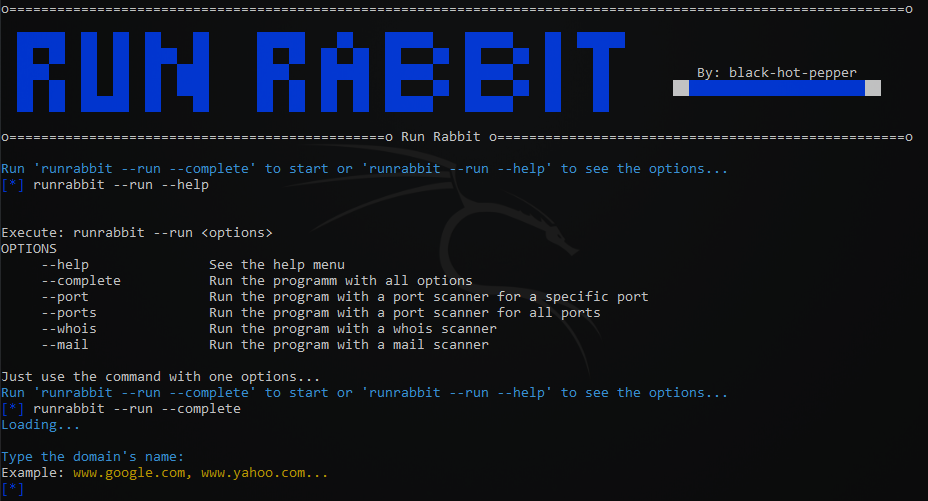

# RunRabbit
<div>
  <h2> 🐇Website recognition program for penetration testing🐇</h2>
  <h3> RunRabbit is a quickly website recognition program for penetration testing and others</h3>
  <p> Curl command, whois, host, and many more commands in just one line! </p>
  
  <p> <br> (RunRabbit é um programa de reconhecimento de sites para pentest, tendo comando integrados como curl, whois, host, e muitos outros em uma só linha de código) </p>
</div>
<div>
  <pre> <p>✔️IP address                    ✔️Port scanner
✔️Registry expiry date          ✔️Updated and creation date
✔️Name servers                  ✔️Phone numbers
✔️Phone numbers                 ✔️Location
✔️Registry domain ID            ✔️Mails</p> </pre>
</div>
<div>
    
</div>
<div>
  <h1> How to Install </h1>
  <p> To install on <b>Linux or Termux</b>, do the command block below: <br> (Para instalar no <b>Linux ou Termux</b>, faça o bloco de comando abaixo)</p>

  ```
  git clone https://github.com/eliezerguimaraes001/RunRabbit.git
  cd RunRabbit
  chmod +x *
  pip install -r requirements.txt
  python3 runrabbit.py
  runrabbit --run --help
  ```
  
</div>
<div>
  <p> To install on <b>Windows</b>, you need to do some essential steps and download the Git in PowerShell: <br> (Para instalar no <b>Windows</b>, você precisa fazer     alguns passos essenciais no PowerShell)</p>
  
  ```
  winget install --id Git.Git -e --source winget
  ```
  <p> Now for the second command, you need to open the Git CMD or Git Bash and run it: <br> (Agora para o segundo comando, você precisará roda-lo no CMD do Git, ou até mesmo no Git Bash)</p>
  
  ```

 git clone https://github.com/eliezerguimaraes001/RunRabbit.git
 
  ```
</div>
